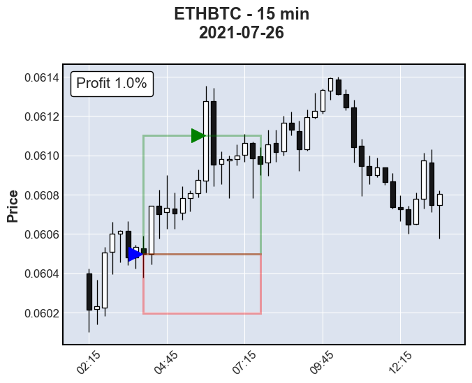
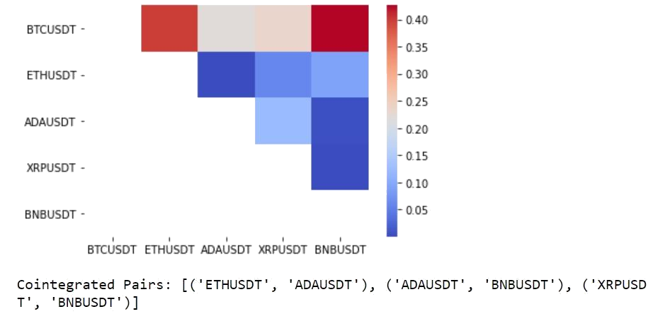
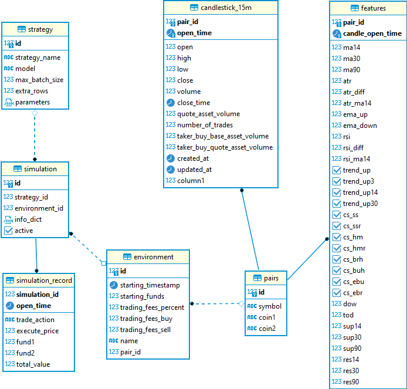
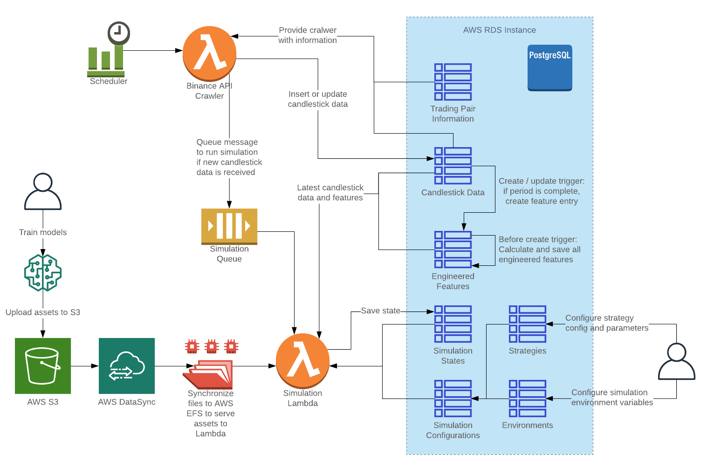

August 24, 2021

<dl>
<dt>Authors</dt>
<dd>Nicholas Miller (nmill@umich.edu)</dd>
<dd>Sophie Deng (sophdeng@umich.edu)</dd>
<dd>Tim Chen (ttcchen@umich.edu)</dd>
<dt>Source Code</dt>
<dd><a href='https://github.com/mads-swaps/swap-for-profit'>https://github.com/mads-swaps/swap-for-profit</a></dd>
<dt>Link to this post</dt>
<dd><a href='https://mads-swaps.github.io/'>https://mads-swaps.github.io/</a></dd>
</dl>

# Background

This post will introduce data scientists who are interested in cryptocurrency exchange models that can be used to predict buy and sell opportunities based on several strategies with in-depth descriptions and access to code that is being used to simulate a variety of models with varying performance.

## What is Forex

Forex is short for foreign currency exchange and is the trading of currencies with the goal of making profits by timing the buy and sell of specific currency pairs while using candlestick charts. Strategies for trading are created by looking for patterns that can be used to predict future currency exchange price fluctuations.

## Candlestick Charts

A candlestick chart is the standard plot used in visualizing trading activity where a candle is represented by a box plot that visualizes 4 prices within a given period: the high, low, open, and close price.  The box, or body of the candle, is colored based on if the open price is greater than the close and differently if vice versa.  In the below chart, a white candlestick means the close price is higher than the open price meaning the price is going up.  The lines coming out of the candlestick body are called "shadows" or "wicks" and represent the price spread for the given period by extending out to the high and low prices.  An individual candlestick can represent a period as short as a second to days or weeks or more.  The chart below is a 15-minute candlestick chart so each candlestick represents a 15-minute period.

<b>Figure X</b> - Here is an example 15-minute candlestick chart for the Ethereum/Bitcoin cryptocurrency exchange rate. This visualization was rendered using the Python library <a href='https://github.com/matplotlib/mplfinance'><code>mplfinance</code></a>.

# Data

## Data Source

In cryptocurrency, “trading pairs” or “cryptocurrency pairs” are assets that can be traded with each other on an exchange.  In this post, candlestick data provided by Binance was used.   The decision to use 15-minute candlestick data was made to strike a balance between having a practical dataset size to work with and a frequency which isn’t too sparse or too overwhelming.  There are actually two ways to obtain the candlestick data from Binance, one is through the [Binance Data Listing](https://data.binance.vision/), another is through its [API](https://github.com/binance/binance-public-data/).

## Manual Data Acquisition

In the initial EDA, a notebook was created to automatically fetch and merge data from Binance into a Pandas Dataframe.  The notebook [binance_fetch_klines.ipynb](https://github.com/mads-swaps/swap-for-profit/blob/main/fetch_data/binance_fetch_klines.ipynb) along with basic configuration changes allows data from different trading pair symbols and candlestick periods to be downloaded.  With this data, initial feature engineering was performed along with target variable creation and the testing of some simple models.

## Data Content

Below is an example of the data provided by the Binance API for a specific currency pair.

|Open Time|Open Price|High Price|Low Price|Close Price|Volume|Close Time|Quote Asset Volume|Number of Trades|Taker Buy Base Asset Volume|Taker Buy Quote Asset Volume|
|:-|-:|-:|-:|-:|-:|:-|-:|-:|-:|-:|
|2017-07-14 04:00:00+00:00|12.500000|12.500000|11.574074|11.574074|0.728274|2017-07-14 04:14:59.999|8.752|26|0.282355|3.268|
|2017-07-14 04:15:00+00:00|11.724841|11.747016|11.627907|11.653518|5.217079|2017-07-14 04:29:59.999|61.042|33|0.235027|2.738|
|2017-07-14 04:30:00+00:00|11.653518|11.653518|11.576754|11.585606|4.631740|2017-07-14 04:44:59.999|53.769|41|1.829643|21.225|
|2017-07-14 04:45:00+00:00|11.585606|11.586277|11.576754|11.581178|3.697253|2017-07-14 04:59:59.999|42.818|61|0.686295|7.948|
|2017-07-14 05:00:00+00:00|11.644968|11.819213|11.600255|11.809164|1.404228|2017-07-14 05:14:59.999|16.520|15|0.100914|1.176|

# Feature Engineering

To expand on the data provided by Binance, additional features allow models to use a single candlestick's record to have access to the context necessary for models to learn.

## Lookbacks

Each record in the dataset represents a single candlestick's data.  Since context likely matters, a lookback feature is the candlestick data for a previous candlestick included with the current record.  A lookback can be for any feature already in the dataset.  For example, if a candlestick data is represented just by `open`, `close`, `high`, `low` price data.  A lookback of 1 could be something like this for a 2-record dataset:

|index|open|close|high|low|open_1|close_1|high_1|low_1|
|:-|-:|-:|-:|-:|-:|-:|-:|-:|
|2021-07-29 01:00:00|0.057756|0.057657|0.057776|0.057576|--|--|--|--|
|2021-07-29 01:00:00|0.057657|0.057697|0.057788|0.057612|0.057756|0.057657|0.057776|0.057576|

## Indicators

Indicators are non-Boolean numerical features that are calculated based on a window of data.

### Moving Averages (MA)

Moving averages are common indicators used in forex and can give insight into price trends or momentum by smoothing out the variations.  A moving average operates on a window that represents the average over a given number of records.  A typical value of `14` is used in forex and for this work three are used: `14`, `30`, and `90`.

The equation for moving average is the following where *k* is the window size on a dataset containing *N* items:

### Average True Range (ATR)

The ATR is an indicator of volatility in the market.  A higher ATR means that the price is more likely to jump around which can result in higher gains but at higher risk.  It is calculated by looking at the true range (TR) of the current record and then averaging out over a window typically of size `14`.  This is also useful in determining the target and stop-loss prices which will be discussed in the different strategies.

### Relative Strength Index (RSI)

The RSI is a momentum indicator that measures the magnitude of recent price changes.  The value is limited between `0` and `100`.  Traditionally, if the RSI value is above `70`, it is considered "overvalued" and the price may soon reverse.  A value below `30` is thus considered "undervalued".  The calculation for this is more complicated.  First, the relative strength is found by comparing the exponential moving averages of the positive differences in closing price divided by the exponential moving averages of the negative differences in the closing price.  Then the value is normalized into an index between `0` and `100`.

### Support and Resistance Lines

Support and resistance are levels that act as barriers that prevent a price from either dropping below (support) or raising above (resistance) an expected price.  The levels can be horizontal or they can represent a trendline.  While there is no agreed formula, this feature dataset will use the `min` and `max`  in a given window.  Again, three windows will be used resulting in three features `14`, `30`, and `90`.

## Signals

Signals are Boolean features represented by either a `1` (True) or `0` (False).

### Upward Trend

Is the current record within the context of an upward trend?  To calculate this, the difference in moving average is used for a given window.

### Candlestick Patterns

There are numerous candlestick patterns and each pattern tells a story of how the market is behaving and what that might mean for the future.  Their names often derive from their shape and the table below provides links to more information about the ones supported in this dataset.  The candlestick pattern signals are implemented according to the below algorithms.

|Pattern Name|Indication|Image|Algorithm|
|:-|:-|:-:|:-|
|Shooting Star|Bearish Reversal|| |
|Hammer|Bullish Reversal||  |
|Bearish Harami|Bearish Reversal|| |
|Bullish Harami|Bullish Reversal|| |
|Engulfing Bullish|Bullish Reversal|| |
|Engulfing Bearish|Bearish Reversal|| |

## Other Features

### Date and Time

Certain days-of-the-week (DOW) or time-of-the-day (TOD) may impact trading trends.  For this reason, DOW and TOD are added as features in a numerical format based on the candlestick's open time.  The DOW is represented by a number between `0` and `6` and the TOD is normalized between `0` and `1`.

### Trading Volume

Included in the candlestick data from Binance are five features that relates to the trading volume.  These are included, unaltered, as available features.  They include `number_of_trades`, `volume`, `quote_asset_volume`, `taker_buy_base_asset_volume`, and `taker_buy_quote_asset_volume`.

# Strategies

## Target and Stop-Loss

In traditional forex trading, stop and limit orders are methods to protect an investor that can be used to buy and sell currencies when a price reaches a certain level.  Using this, a predictive model can focus only on buy opportunities and then rely on a simple strategy to determine when to sell. A sell strategy defines two sell prices for a given buy opportunity.  The first sell price is called the **target**, which is the high price that results in a profit and the next is the **stop-loss**, which is the low resulting in a loss. When a buy opportunity is identified, and a target and stop-loss is calculated, the purchase can be made and the sell will be automatic either by the exchange or by another system that monitors the market price.

In the example below, a buy opportunity is identified at the close of the 4:00am candlestick at a price of `0.060497` Bitcoin (`BTC`) per 1.0 Etherum (`ETH`).  Buying ETH at this price, a target and stop-loss is calculated with a `1.0% : 0.5%` ratio, thus `0.061102` for a target and `0.060195` for a stop-loss.  The price reaches the target price eight candlesticks later or 2 hours later at 6:00 am, thus securing `1.0%` profit (assuming no fees).

<b>Figure X</b> - Example <code>ETH</code> buy opportunity.

### Identifying Buying Opportunities

Using a target and stop-loss approach simplifies the model to a binary classification problem but a new problem is created, there is no labelled data to train on.  The goal here is to create a label for each record.  A record being the data for one candlestick.  This includes the low, high, open, and close prices as well as some additional features such as volume and number of trades.  Using the close price for each record, a target and stop-loss price is calculated using the same threshold ratio that will be used on the deployed model.  Using the example above, a ratio of `1.0% : 0.5%` returns a target price `1.0%` higher than the close price and a stop-loss of `0.5%` below the close price.  The next step is to peek into the future and see what happens first. Does the price reach the target price first or the stop-loss?  If it reaches the target, the record's label will be a `1` meaning "buy".  Another consideration is how far in the future it should look.  This is called the "window".  Typically, 15 future candles are used.  If the price reaches stop-loss first or if the price hovers between the target and stop-loss within the window, the record will be a `0` meaning "not buy".

A common question is why not make the stop-loss as small as possible?  Setting the stop-loss too small can result in being "wicked out" of a trade.  Looking at the figure above, if the stop-loss is made too small, the wick of the next candle after the buy could poke through resulting in the stop-loss being breached before the target price, thus resulting in a "not buy".  Therefore, setting a higher stop-loss gives some buffer for the price to fluctuate before a gain is achieved while minimizing losses.

For the remainder of the target stop-loss strategy discussion, the strategy will focus on `BTC` buy opportunities with the starting coin being `ETH`.  In other words, `ETH` will be used to buy `BTC` and will be sold back to `ETH` when the price reaches a target or stop-loss price.  This can cause a bit of confusion because the price is the number of BTC within 1 ETH which means, a profit is made when the price actually drops thus the target will be lower than stop-loss (opposite the figure above).  It is for this reason the `reverse` flag is set to `True` (see below).

### Determining Ideal Ratios

In the example above, a `1.0% : 0.5%` ratio is used but is this a good ratio to use?  Setting a ratio of `10% : 5%` might be too high because it would be unlikely to gain `10%` resulting in a very sparsely labelled dataset.  Likewise, using a ratio of `0.1% : 0.005%` could be too low, especially when considering transaction fees (to be discussed later).  It's also worth mentioning that using a percentage might result in inconsistencies since some currency pairs are more volatile than others and volatility for a given pair can change over time.  For this reason, forex traders sometimes use a ratio of the ATR.  For example, using an ATR `2:1` ratio is a good place to start.

Models generally perform better on balanced data so getting half of the labels to be `1` is ideal.  But achieving this with a ratio that is consistent and profitable may not be practical.  To find a good ratio, different multiples are generated and the percent of `1`'s is plotted.  On the below ATR ratio figure, the multiple of `2x` means the numerator is `2` times the denominator, where the denominator is the `x-axis` value.  Therefore, when `x-axis = 3` the ratio is `6:3`.  When the multiple is `4x` and `x-axis = 2`, the ratio is `8:2`, etc.  For the percentage ratio, the `x-axis` represents the numerator, and the denominator is then the numerator divided by the legend's label.  For example, when `x-axis = 0.01` for the `/2` line, the ratio is `1.0% : 0.5%`.

<b>Figure X</b> - Finding the best ratios to maximize label data using a window of <code>30</code> on ETHBTC 15-minute candles.

Unsurprisingly, as the ratio grows or ratio multiple grows, fewer buy opportunities can be found in the data because there are fewer windows where high profits can be achieved and fewer windows where smaller stop-losses don't get wicked out by the volatility of the market.  None of the plots reaches the goal of `50%` but the results provide plenty of options to avoid sparsely labelled data.  From this analysis, the ATR Ratio is maximized at `2:1` with approximately `40%` of the labels being `1`.  The percentage ratio is maximized at `1.0% : 0.5%` with approximately `27%` of the labels being `1`.

### Building Xy Datasets

The imbalance of a dataset is not the only criteria for determining if one ratio is better than another, but it does give a sense.  To explore this further, several labelled datasets are generated with different labeling strategies by changing ratios, the window, and whether the ratio represents a percentage or the ATR ratio.  The following table shows 12 different labeled datasets generated that are used to compare different model performances.

|dataset|use_atr|ratio|reverse|window|size|true_labels|imbalance|train_imbal|test_imbal|
|:-|:-:|:-:|:-:|:-:|-:|-:|-:|-:|-:|
|20210806a|False|(0.01, 0.005)|True|30|141174|37979|0.269023|0.262033|0.319201|
|20210806b|False|(0.01, 0.0025)|True|30|141174|23782|0.168459|0.169634|0.196954|
|20210806c|False|(0.0075, 0.0025)|True|30|141174|29824|0.211257|0.220094|0.233808|
|20210806d|True|(2, 1)|True|15|141174|44769|0.317119|0.317522|0.341973|
|20210806e|True|(4, 2)|True|15|141174|17024|0.120589|0.123430|0.124245|
|20210806f|True|(4, 1)|True|15|141174|15304|0.108405|0.110710|0.111111|
|20210806g|True|(4, 2)|True|30|141174|31640|0.224121|0.227442|0.238302|
|20210806h|True|(4, 1)|True|30|141174|26488|0.187627|0.189435|0.201498|
|20210806i|True|(2, 1)|True|30|141174|55315|0.391821|0.391990|0.409738|
|20210806j|False|(0.01, 0.005)|True|15|141174|29035|0.205668|0.187259|0.265218|
|20210806k|False|(0.01, 0.0025)|True|15|141174|19184|0.135889|0.129528|0.174831|
|20210806l|False|(0.0075, 0.0025)|True|15|141174|25995|0.184134|0.183938|0.224619|

It is during this time that feature engineering was initially performed but later not necessary since the AWS pipeline has already completed this step (discussed later).  For this reason, each dataset already includes all the features discussed in the feature engineering section plus `14` lookbacks resulting in `542` features (a lookback is the previous records features).

Each dataset is also split into train and validation sets according to the table below.

|Purpose|Start Date|End Date|Number of Records|
|:-|:-:|:-:|-:|
|*not used*|--|2017/12/31|16353|
|Train|2018/01/01|2020/12/31|104796|
|Validation|2021/01/01|2021/07/29|20025|
|Test|2021/07/30|--|--|

In 2017, Binance started reporting figures and it took some time for these to develop robustness.  For this reason, 2017 is excluded from the training and testing sets.  The final test set analysis is performed on AWS in simulation using near-live data.

### Simulating Trades on Labelled Data

To get a sense of what an ideal profit would look like for each of the labelling strategies, it is necessary to run them through a simulator.  Why is this necessary?  Why can't this be calculated from the above figures?  To answer this, imagine having two candles, one after another, where the labelling has marked both as `1`.  In a deployed model, when a buy signal is received, all available currency will be spent.  When evaluating the next candlestick data, the model will be evaluating for selling, not buying, so that candlestick will not be evaluated for a buy opportunity.

The simulator logic is the same logic as in the deployed model pipeline but instead of looking at the predictions, it looks at the validation labelled data which is already guaranteed to contain profitable trades assuming it uses the same ratio and other hyperparameters as the dataset's labelling strategy.  The simulator works, in short, by progressing through the labeled data, looking for the next buy opportunity, calculates the target and stop-loss prices, finds the next record that surpasses one of these, calculating the profit/loss along with any fees, and then repeats the process until it reaches the end.  The last sell indicates the maximized profit achievable for the dataset.  The below table shows how each dataset's number of trades and maximized profit based on a starting value of `1 ETH` and a fee of `0.1%` for each buy or sell transaction using the validation data.

|dataset|sim_num_trades|sim_max_profit|sim_bad_trades|
|:-|-:|-:|-:|
|20210806a|1179.0|13228.993600|0.0|
|20210806b|1093.0|6620.481356|0.0|
|20210806c|1456.0|3126.592203|0.0|
|20210806d|1128.0|17342.974458|1.0|
|20210806e|335.0|416.560613|0.0|
|20210806f|340.0|467.521090|1.0|
|20210806g|368.0|1084.998178|0.0|
|20210806h|376.0|1295.216356|2.0|
|20210806i|1033.0|9843.078247|2.0|
|20210806j|1199.0|15539.693313|0.0|
|20210806k|1097.0|6837.112001|0.0|
|20210806l|1497.0|3921.842442|0.0|

While the label data guarantees a trade is profitable, it doesn't guarantee the profit surpasses the fee amount.  For this reason, some labels result in bad trades.  In the above table, only the ATR ratio datasets result in bad trades which makes sense since all the percentage-based datasets are larger than the fee.  Keeping an eye on this number will be important when using an ATR ratio dataset.

### Comparing Datasets with Base Classifiers

For each of the datasets, a set of base classifiers are trained.  Below is a table of the base classifiers used.

|Name|Parameters|
|:-|:-|
|GaussianNB|*none*|
|LogisticRegression|`random_state=42, max_iter=10000`|
|RandomForestClassifier|`random_state=42, n_jobs=-1`|
|AdaBoostClassifier|`random_state=42`|
|GradientBoostingClassifier|`random_state=42`|
|XGBClassifier|`n_jobs=-1, random_state=42, use_label_encoder=False`|
|MLPClassifier|`random_state=42`|

One note about the `MLPClassifier`: since this classifier is sensitive to scaling, `make_pipeline()` with `StandardScaler()` is used.

This exercise determines the F1-score, precision, recall, and the simulator's profit on the validation set for each dataset/classifier combination resulting in `84` results.  This was performed two more times on the same datasets and classifiers but first reducing the number of lookbacks from `14` to `3` and then to `0` thus reducing the number of features each time and ending up with a total of 252 trained model results.

### Identifying Best Performing Dataset/Classifier Combinations

When it comes to ranking the performance, precision is a good starting point.  A high precision means the model has reduced the number of false positives (FP).  In other words, it reduced the chance of predicting a buy that is unprofitable--the absolute worst case that should be avoided.  A low recall, on the other hand, just means the model is predicting fewer buy opportunities than expected.  This is generally fine so long as it does predict buys often enough (one true positive every couple of days on average).

Looking at precision alone can be misleading.  On the extreme side, a precision of `1.0` is perfect precision but if the recall was very low, such as having only one `1` true positive (TP), the model would be ineffective since it so rarely makes predictions.  For this reason, the F1-score is not a good show of performance, and several factors must be considered.  Maximizing precision and the number of TPs is the overall goal.  Ranking based on the number of TPs does little in the way of explaining performance if the number of FPs is still high. Therefore, ranking is performed first on precision, second on the difference between TPs and FPs and then on the ratio between. The top 10 models based on this ranking are shown in the table below.

|Rank|Classifier|Dataset|Lookbacks|TP|FP|Diff|Ratio|Precision|Recall|Sim. Profit|
|-:|:-|:-|-:|-:|-:|-:|-:|-:|-:|-:|
|1|LogisticRegression|20210806i|0|453|277|176|1.64|0.6204|0.0082|1.3210|
|2|AdaBoostClassifier|20210806g|14|98|13|85|7.54|0.8824|0.0031|1.0243|
|3|LogisticRegression|20210806i|3|840|631|209|1.33|0.5708|0.0152|1.6651|
|4|RandomForestClassifier|20210806g|14|2075|1856|219|1.12|0.5278|0.0656|1.2348|
|5|LogisticRegression|20210806i|14|1731|1535|196|1.13|0.5299|0.0313|1.0503|
|6|LogisticRegression|20210806d|0|40|26|14|1.54|0.6000|0.0009|1.0045|
|7|GradientBoostingClassifier|20210806d|0|58|38|20|1.53|0.6000|0.0013|1.0126|
|8|GradientBoostingClassifier|20210806i|3|2710|2460|250|1.10|0.5241|0.0490|0.6239|
|9|GradientBoostingClassifier|20210806i|14|1919|1770|149|1.08|0.5201|0.0347|0.8400|
|10|AdaBoostClassifier|20210806a|14|60|54|6|1.11|0.5263|0.0016|0.9951|

Reviewing the simulated profit for each of these, the top 7 all produce profits suggesting the ranking is robust.  The highest performing models have then been deployed to AWS for live simulations which is discussed below.

### Building a Logistic Regression Ensemble

Many logistic regression models outperformed other models and are easy to train and tune so it seems logical to ask if performance could be improved further with an ensemble.  To build an ensemble, the prediction from each model in the ensemble is weighted and summed and if that sum is greater than or equal to some threshold, the prediction would be considered a `1` or else `0`.  The weights will be the precision of each model on the validation set.  The equation for this can be explained as follows:

Where *r_j* is the prediction result for the *j*th record, *p_m[i]* is the prediction of *i*th model in *m*, *c_m[i]* is the precision of said model, and *t* is the hyperparameter threshold.  Any model that has a validation set precision of `0` would always be zeroed out so these models will not be included in the ensemble.

Finding a good value for *t* can be achieved by trying out by measuring the precision, recall, and simulated profit.  Another issue that needs to be considered is that the datasets use different ratios so which ratio should be used on the ensemble?  It stands to reason that the model/dataset with the highest precision should be used since that carries the most weight.  However, simulations show this is not always the case as will be shown later with the scaled version shown later.  For the logistic regression, it so happens that these are aligned.  In the below figure, profit is maximized at a threshold of `0.12` with a value of `1.86` which surpasses any individual model simulation performance.

<b>Figure X</b> - Simulated precision, recall, and profit for varying thresholds on a Logistic Regression ensemble.

### Scaling Data in Isolation

There is a forex theory that a good strategy is generalizable, in that it can be applied to any currency pair, even opposite pairs, and be profitable.  All models previously train (except for the MLP) have not been scaled so it is impractical to expect one of these models to perform well for both ETH to BTC and the opposite BTC to ETH.  Likewise, using standard scaling, like done for the MLP, is also not practical since the dataset for BTC to ETH trades is scaled very differently.  So, can the data be scaled in isolation?  The answer is yes, but at the cost of zeroing out one of the features.  By defining the open price as the mean and using the close, high, and low in the calculation of a standard deviation, all price data can be scaled such that one standard deviation difference is -1 or 1.  The formula can be described as the following:

Using this scaling algorithm, each record is individually scaled independently of the other data in the dataset.  Repeating the same model/dataset comparison using this scaler produces another 252 trained models.  Many of the logistic regression models returned profits in the simulation of `ETHBTC` suggesting again an ensemble might outperform a single model.

### Ensemble with Custom Scaling

Using the scaler discussed previously, a new ensemble of logistic regression models can be produced with the goal of having a model that be able to perform on both `ETHBTC` and `BTCETH` trading.  Again, a threshold and ratio are brute-forced.  In the below figure, profit is maximized at a threshold of `0.10` with a value of `1.35` again surpassing any individual model simulation performance.  This time, the profit is maximized with a ratio of `4:2` in contrast with the highest precision dataset being `2:1`.

<b>Figure X</b> - Simulated precision, recall, and profit for varying thresholds on a scaled Logistic Regression ensemble.

### Deep Neural Network

To see how a deep neural network can perform on the same datasets used to train base classifiers, the dataset `20210806i` is chosen for its consistent performance.  A variety of ResNet28 models are built using PyTorch and trained with varying hyperparameters or model changes over 20 epochs on a GPU to allow for quicker iteration.  A subset of these run configurations is shown in the table below.

|Model Name|Scaler|Width|Optimizer|Learning Rate|
|:-|:-|-:|:-|:-|
|nm_torch1_alpha33|CustomScaler1|128|AdamW|0.006|
|nm_torch1_alpha34|*none*|128|AdamW|0.006|
|nm_torch1_alpha35|*none*|32|AdamW|0.001|
|nm_torch1_alpha36|*none*|32|AdamW|0.006|
|nm_torch1_alpha37|CustomScaler1|32|AdamW|0.006|
|nm_torch1_alpha38|CustomScaler1|128|AdamW|0.03|

Below is a figure of the training and validations results of this subset of models.  While 20 epochs are still quite young for a comprehensive analysis, some trends do start to appear which only become more pronounced with further epochs and as many as 100 when the training set begins to converge.

<b>Figure X</b> - Simulated precision, recall, and profit for varying thresholds on a scaled Logistic Regression ensemble.

The general trend that is consistent across all models is that the training loss drops predictably and consistently but the validation loss steeply rises after just a few epochs.  The recall on the validation set generally does slowly improve which also improves the F1-score but the precision remains erratic, averaging around `0.5`.  This unexpected behavior is likely due to a shift in how the `ETHBTC` market behaves over time, so the model is learning a strategy that is no longer profitable in 2021.  To validate this, each model was simulated with the results in the below table.

|Model Name|Buys|Starting Value|Ending Value|
|:-|-:|:-:|:-|
|nm_torch1_alpha33|3989|1.0|0.3472|
|nm_torch1_alpha34|0|1.0|0.0|
|nm_torch1_alpha35|51|1.0|1.0391|
|nm_torch1_alpha36|0|1.0|0.0|
|nm_torch1_alpha37|3083|1.0|0.4240|
|nm_torch1_alpha38|236|1.0|0.9454|

# Statistical Arbitrage
## What is Statistical Arbitrage
Statistical Arbitrage, also known as stat arb, refers to trading strategies that use statistical techniques to profit from patterns between financial instruments. Gerry Bamberger developed the first arbitrage strategy using pairs trading at Morgan Stanley in the 1980s. There are multiple types of Statistical Arbitrage. Market Neutral Arbitrage, Cross Asset Arbitrage, and Cross Market Arbitrage are most commonly used. Since the focus is on the cryptocurrency spot market and the product type is similar to vanilla FX without other underlying, Market Neutral Arbitrage is the natural choice for building a portfolio with multiple bitcoin pairs. As its name suggests, the returns of Market Neutral Arbitrage strategy are not affected by the market's price movement. Hence, it is market-neutral with a beta of zero.

## Mean Reversion Strategy and Pairs Trading
Statistical Arbitrage strategy uses mean reversion principle to take advantage of the price inefficiencies between a group of securities. For instance, if there is a pair of instruments that share similar fundamentals and belong to the same sectors, even though in the short term the price may fluctuate, it is expected that these instruments behave similarly and the ratio or spread of such instruments to remain constant. Based on the mean reversion principle, if one instrument outperforms the other, it is temporary and will converge to the normal level in time. Pairs trading can be executed to buy the underperforming instrument and sell the outperforming instrument.

## Cointegration
To develop mathematical models that best describe the data, time series analysis is performed. Such analysis usually involves methods like ordinary least squares with a key assumption that the statistical properties of the time series such as variances and means are constant. Non-stationary time series (or unit root variables) fail to meet this assumption. Therefore, these time series need to be analysed with a different method called **cointegration**. More formally, the series *X_t* and *Y_t* are cointegrated if there exists a linear combination of them which is *stationary* i.e:   

 ,where *epsilon_t* is a *stationary* time series.

## Test for Cointegration
Intuitively, some linear combination of the time series removes most of the auto-covariance and is mostly white noise, which is useful for pairs trading. Since the linear combination of prices of different assets is white noise, this relationship is expected to mean revert and trade can be executed accordingly.

In the case of pairs trading, the linear combination is expressed in terms of spread:

,where a minus sign is inserted to express that one asset is long and another is short, so that *h* defined is usually positive. If the spread is stationary, the currency pairs are cointegrated.

**Engle-Granger two-step method** is used to check whether the spread is stationary. It involves the following: 

1) Regressing one series on another to estimate the stationary long-term relationship  
2) Applying an **Augmented Dickey-Fuller (ADF)** unit-root test to the regression residual. This test is implemented in `statsmodels.tsa.stattools.coint`.

Five coins are selected, which are Bitcoin(BTC/USDT), Ethereum(ETH/USDT), Cardano(ADA/USDT), Ripple(XRP/USDT) and Binance Coin(BNB/USDT). The Engle-Granger test suggests that 3 pairs are cointegrated for a threshold of *alpha=0.05*. The below heatmap shows the p-values of the cointegration test between each pair of coins.

## Trading Strategy with Spread
In order to calculate the spread, a linear regression is implemented to get the beta coefficient. This coefficient can be interpreted as the hedge ratio to make the portfolio of the two coins stationary. In pair trading, one coin is long and simultaneously *hedge ratio* number of the other coin is short so that the linear combination of the two coins is stationary. As the cryptocurrency market is very volatile, it is more accurate to use rolling beta derived from Rolling Ordinary Least Square (`RollingOLS`) in order to estimate a hedge ratio that can vary with time.

In the stock market, the price ratio of the prices *S_1/S_2* is often used as a signal. The problem is that the ratio is not necessarily stationary or might not remain stationary throughout the period. And this is a problem encountered: as the price ratio instead of a dynamically changing hedge ratio is used, the two assets stopped being cointegrated after a while and observed some large losses in daily P&L calculation.

The absolute spread is less helpful as the prices of coins can be very different in scale. Thus, the spread is normalized by transforming it to a z-score and use this z-score to derive our trading signal:

1) enter a long (resp. short) position if the spread is below (resp. above) one, which means that the spread has moved one standard deviation below (resp. above) its moving average.

2) exit trades when the spread changes sign which signals a mean reversion.

Let's focus on the cointegrated pair (ETH/USDT, ADA/USDT) and visualize the price series, rolling beta, z-score, and the performance of the strategy against the benchmark (buy and hold). As explained above, statistics based on rolling windows is used to incorporate more recent data - a short window of one hour to smooth out the current spread information, a long window of 12 hours as a measure of the rolling mean as well as a 12-hour rolling standard deviation. The strategy outperforms buy and hold individual coins excluding costs.

## Risks of Statistical Arbitrage
Statistical arbitrage models contain both *systemic* and *idiosyncratic* risks. As a result of the economy and market conditions, cointegrated cryptocurrencies can stop cointegrate at some point in time. In this case, the cointegration hypothesis is not validated on the out-sample data (30% of the data history) at 10% threshold - recall that the same hypothesis cannot be rejected at 5% threshold on the in-sample data. As a matter of fact, the same strategy proves to be not as profitable as a buy and hold in each individual coin. Thus, it is important to make sure that such a relationship persists during the time period of interest. Another challenge is that once enough players discover the statistical relationship, the arbitrage opportunities usually diminish or simply disappear.

# Momentum Trading
Momentum trading evaluates the strength of an asset's current trend to buy an asset while the price is rising and sell it at peak price before the asset's price starts to lose its momentum. This strategy perfectly reflects the common expression that "trend is your friend." By following the trend signals, volatile market like cryptocurrency can be profitable for short-term gains through a consistent buy and sell action.

For example, when ETH/BTC increases in price, it attracts more attention from traders. This in turn pushes the price even higher. Sometimes, the sentiment called a fear of missing out (FOMO) would cause the price to increase for much longer than expected based on fundamental analysis until a large number of traders believe that the price is overbought and start to sell off. That is when the trend reversal happens. The new downtrend is also a momentum trading opportunity where traders enter the market by going short.

## How to measure momentum
The above-mentioned indicators such as MA, ATR and RSI are considered as alpha factors resulting from transforming raw market data using arithmetic and are effective features for the momentum strategy. However, in this section lagged returns, momentum, volatility and distance are used as features for logistic regression.

## Features
- **Lagged returns**: In addition to calculating most recent (*t* and *t-1*) return, more information about the strength of the cryptocurrency can be extracted from returns calculated using price data dated further back in time. For example, `lag = 3` creates three features with 1, 2, and 3 lookback period.  

- **Momentum**: Momentum is defined as the rolling mean of returns using a pre-defined window that captures recent change in return.

- **Volatility**: Volatility is defined as the rolling standard deviation of returns using a pre-defined window that is usually longer than that of momentum.

- **Distance**: Distance measures how far price has moved from its average value. It is the difference between price and its rolling mean.

## Signals
Signals based on the most recent return are binarized outcomes: 1 if return is positive, 0 otherwise. More precisely the *y* label is encoded as:

## Time series and cross-validation
Cross-validation (CV) is a method for model selection. The main idea behind CV is to split the data several times so that each split is used once as a validation set and the remainder as a training set. A key assumption of CV is that the data is **independently and identically distributed (IID)**. However, financial returns often violates the IID assumptions. Therefore, it is important that splits respect temporal order to avoid **lookahead bias**. This can be achieved using scikit-learn's `TimeSeriesSplit` class which ensures that the test periods do not overlap and are located at the end of the period available in the data. After a test period is used, it becomes part of the training data that rolls forward and remains constant in size. Parameter tuning is done via `GridSearchCV` with performance metric `roc_auc` score.

A typical train-test-split of 80/20 is done using `TimeSeriesSplit` on the data from 2017/07/14 to 2021/08/03. Logistic regression has only one hyperparameter, C which is set to [1.e-05, 1.e-04, 1.e-03, 1.e-02, 1.e-01, 1.e+00, 1.e+01, 1.e+02, 1.e+03, 1.e+04, 1.e+05]
for grid search purpose. Hyperparameter tuning iterates under different lags of [1,3,5,7]. From below validation curves, it is evident that the AUC score is not sensitive to the change of hyperparameter C as both training and cross-validation curves are almost flat. The learning curve has a shaded confidence interval band around the cross-validation error which indicates that the prediction errors are more driven by variance than by bias. The cross-validation performance continues to drop from a training size of 10,000 and eventually training and cross-validation scores tend to converge except for lag=1. It is unlikely that additional data will help improve performance. 

# AWS Infrastructure

An AWS credit of 600 USD was used to build a scalable production environment where it is easy to deploy changes without having to worry too much about provisioning and managing hardware.

<b>Figure X</b> - Simplified diagram of AWS services used for data acquisition and simulation.

## Amazon Relational Database Service

Amazon RDS with a PostgreSQL engine was selected for its familiarity and expandability.  A low-performance instance of size t2.micro is sufficient with the current dataset size and loading based on simulation usage despite being the second smallest t2 instance.

The RDS database consists of 7 tables:

| Table Name | Description |
| --- | --- |
| pairs | Defines the currency pair information |
| candlestick_15m | The raw 15m candlestick data |
| features | Engineered features-based candlestick data |
| environment | Defines the simulation environment, such as starting funds, fee structures, and the currency pair |
| strategy | Defines the trading strategy configurations and parameters |
| simulation | Defines the simulation based on an environment and a strategy while keeping track of persistent variables. |
| simulation_records | Historical records of all periods for each simulation. |

<b>Figure X</b> - ER Diagram of the Database.

The SQL files to recreate the database are available [here](https://github.com/mads-swaps/swap-for-profit/tree/main/aws/rds).

## AWS Lambda and the Serverless Application Model

AWS Lambda, a managed serverless service, was selected as the primary compute resource to handle the cloud computing that keeps the database up-to-date and the simulations running.  Lambda was selected instead of Elastic Compute Cloud (EC2) because of the nature of the data and simulation, where the majority of the computations are performed at regular intervals with long idling periods in between.  As opposed to EC2, Lambda excels at automatic scaling and its pricing scheme matches with spikes in computational load.  With the Lambda set up, hundreds of simulations can be done in seconds while it takes up to minutes to do the same with a similarly specified EC2 resource.

To deploy the Lambda functions, the AWS Serverless Application Model (SAM) framework is used.  The SAM framework automatically manages AWS infrastructures through configuration files.  Once configured, Lambda functions and their settings, security, and network configurations can be updated and deployed automatically.  The Lambda functions are packaged as container images and uploaded to the Amazon Elastic Container Registry, allowing for version control.

The following Lambdas perform the AWS compute:

| Function Name | Purpose | Triggered By |
|:-|:-|:-|
| BinanceCrawlerFunction  | Fetch Binance candlestick data | Scheduler (every 3 minutes) |
| SwapSimulationFunction  | Run simulations  | AWS SQS (complete candlestick) |

## Amazon Simple Storage Service, Elastic File System, and DataSync

To store the model assets on AWS, Amazon S3 and EFS managed storage services are used.  The main difference between S3 and EFS is that S3 is an object store while EFS is a file system for compute services.  Both storage services are used as they provide different benefits in the workflow.

|  | S3 | EFS |
| --- | --- | --- |
| Version Control | Yes | No |
| File Management | Anytime directly through AWS console or GUI and CLI clients | Must be mounted by a compute service such as EC2 with remote file transfer service to make changes |
| File System Access | Objects must be copied to local file system before use | Can be accessed directly once mounted |

S3 provides a simple interface for uploading model assets such as pre-trained classifiers, neural networks, and scalers since a compute resource isn't necessary.  EFS, on the other hand, works more efficiently with the Lambda functions by not needing to copy assets every time the function has a cold start.  To combine the convenience of S3 and efficiency of EFS, a synchronizing task is used called Amazon DataSync to copy the S3 files to the EFS drive by manually triggering the event each time new assets are uploaded to S3.  Although not configured as such, it is possible to set the task to automatically execute every time objects in the S3 buckets were updated, making it a fully automated process.

## Amazon Simple Queue Service

When the `BinanceCrawlerFunction` Lambda processes a complete candlestick for a particular cryptocurrency pair, it enqueues that pair's simulation task on a queue in AWS's Simple Queue Service (SQS).  This queue then triggers the `SwapSimulationFunction` Lambda with the pair ID as its parameter. SQS was chosen for how easy it is to set up as well as its integration with Lambda functions.

## Detailed Flow Diagram

The completed flow of the AWS architecture can be seen below:

<b>Figure X</b> - Detailed diagram of AWS services used for data acquisition and simulation.

The main flows are:

| Flow | Description | Results |
| --- | --- | --- |
| Scheduler triggering Binance Crawler Function | A scheduler triggers the crawler periodically to get new candlestick data.  Any data that is updated will be saved to the database, with the latest (not yet closed) candlestick data marked as such. | If the `open_time` for the latest candlestick changed, additional simulation messages are queued for the simulation function. |
| Database triggers | Multiple database triggers are used to automatically generate features once a candlestick is closed. | As the triggers are performed before the records are created, these features are created before the crawler enqueues the simulation messages. |
| Deploy model assets | New models can be deployed without having to redeploy the Lambda functions by uploading the files to S3 and executing the DataSync task. | With about a 2-3 minute wait time, the new assets will be deployed to the EFS accessible by the Lambda functions. |
| Configure simulation | Configurations for simulations can be done directly in the `strategy`, `environment`, and `simulation` database tables, with custom parameters specified for each strategy. | Once the simulation entries are set up, the simulation will automatically run starting from the beginning during the next period. |
| Running the simulation | Simulations are triggered whenever a completed period of candlestick data is processed.  Simulation details are updated into the simulation records and the QuickSight dashboard is automatically updated with the latest data. | The simulation lambda is triggered from SQS messages enqueued by the crawler lambda. |

## Amazon QuickSight

Amazon QuickSight is a business intelligence service.  It provides similar features to that of Power BI and Tableau, but have tighter integrations with the AWS ecosystem, such as directly accessing data from the RDS.  For this project, QuickSight was used to visualize ongoing cumulative returns for each simulation, with additional interactive features such as filtering and grouping for further comparisons.

<b>Figure X</b> - Amazon QuickSight visualization.

## Amazon CloudWatch

Amazon CloudWatch is AWS's monitoring service.  Logs from various services are sent to CloudWatch, where entries individually or visually as a group can be examined.  Dashboards can be created for a centralized view of all related services and alerts can be configured for when certain thresholds are exceeded.  A dashboard was created to monitoring RDS, SQS, and Lambda's metrics and performances.  Periodic spikes can be observed due to the regularity of incoming candlestick data and resulting simulation computations.

<b>Figure X</b> - Amazon CloudWatch monitoring dashboard showing system under regular load and usage.

# Evaluation
Below table illustrates the evaluation metrics for visualizing the performance of a strategy.

|Evaluation Metrics|Descriptions|
|:-|:-|
|Equity Curve|Total value of a portfolio over time|
|Cumulative Returns|Accumulative percentage change of a portfolio value|
|Drawdowns|A peak-to-trough decline during a specific period. It is an important measure of downside volatility|
|Rolling Volatility|Standard deviation of price from its mean, using a rolling winow|
|Rolling Sharpe Ratio|Reward-to-risk ratio. The ratio of the expectation of the excess returns of the strategy to the standard deviation of excess returns using a rolling window.|

A function that accepts end of the day portfolio value (close price * quantity) and close price is written to automate portfolio evaluation process. It produces five graphs as per below. Generally speaking, equity curve and cumulative returns curve with positive slope is preferred as it suggests that a strategy is profitable. Observing the time and magnitude of drawdowns provides insights to volatile period of trading, which can be further analysed for better risk management and alpha capture.

# Next Steps

## Statistical Arbitrage Simulation

Currently, the simulation framework only provides data and features for the cryptocurrency pair that its environment specifies.  Unfortunately, the statistical arbitrage method requires additional data to be passed into the simulation function for it to be able to make predictions.  The ability to pass data from other pairs was out of scope and although it was required for the statistical arbitrage method, we were unable to fit it in before submission.  With the current simulation framework, the additional data required can be requested through optional parameters or fetched directly from the database in the prediction method.

## Paper Trading on Binance

Binance offers a Demo Exchange to test strategies using virtual capital.  By building support for this Demo Exchange, we can get more realistic fees and slippage and allow us to evaluate our best strategies with better confidence.  The Demo Exchange supports API calls.  A potential implementation method for this is to set up a new SQS queue with the purpose of executing trades on the Demo Exchange, then it will require minimal changes on the current simulation function - only sending a message whenever a strategy calls for a buy or sell action.  Additional checking on the execution and validation of such actions can be done on a separate trading function that is specifically built.  In addition to that, we can also pull out the current simulation code as a dummy exchange and plug in exchanges as a parameter for the environment, allowing for additional exchanges to be added in the future.

# Statement of work

<dl>
    <dt>Nicholas Miller</dt>
    <dd>Feature engineering</dd>
    <dd>Target and stop-loss</dd>
    <dd>Training and evaluation</dd>
    <dd>Final report</dd>
    <dt>Sophie Deng</dt>
    <dd>Statistical arbitrage</dd>
    <dd>momenetum modeling</dd>
    <dd>Training and evaluation</dd>
    <dd>Final report</dd>
    <dt>Tim Chen</dt>
    <dd>Data collection</dd>
    <dd>Feature engineering</dd>
    <dd>AWS setup and maintenance</dd>
    <dd>Final report</dd>
</dl>
